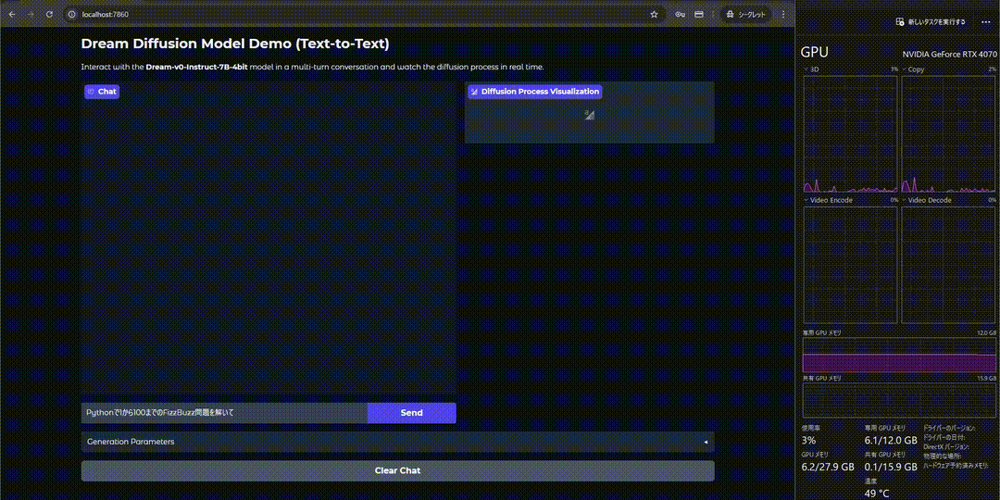

# Dream 7B (4bit) on Docker

[Dream 7B](https://github.com/HKUNLP/Dream)を4bit量子化した[Dream-v0-Instruct-7B-4bit](https://huggingface.co/Rainnighttram/Dream-7B-bnb-4bit)をDockerで簡単に動かせるようにしました.



`app.py`のほとんどは[生成過程](https://huggingface.co/spaces/multimodalart/Dream)が見れる[本家](https://github.com/atsuyaide/Dream-4bit/blob/main/app.py)のコードを修正したものです.
変更箇所は`app.py`上でコメントアウトしているので確認できます.

動作確認をした環境

- OS: Ubuntu 22.04.5 LTS(WSL2)
- GPU: RTX 4070(VRAM 12GB)
- Docker: 27.3.1, build ce12230

## 起動方法

1. UID/GIDが1000以外の場合, `.env.template`をコピーして`.env`を作り適切に設定してください.
2. Dockerを使い起動します.

```shell
docker compose up --build
```

3. ブラウザで`http://localhost:7860/`にアクセスします.

## Dockerを使わない場合

1. 必要なライブラリをインストールします.(CUDNNなどは入っている前提)

```shell
pip install torch==2.5.1+cu121 --index-url https://download.pytorch.org/whl/cu121
pip install transformers==4.46.2 bitsandbytes==0.43.2 gradio==5.31.0
```

2. 実行します.

```shell
python app.py
```

3. ブラウザで`http://localhost:7860/`にアクセスします.
